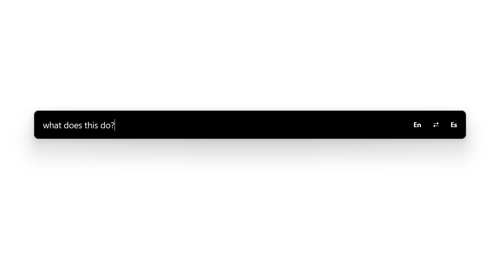
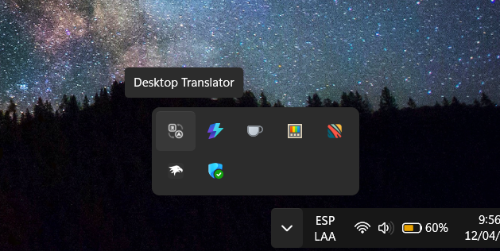
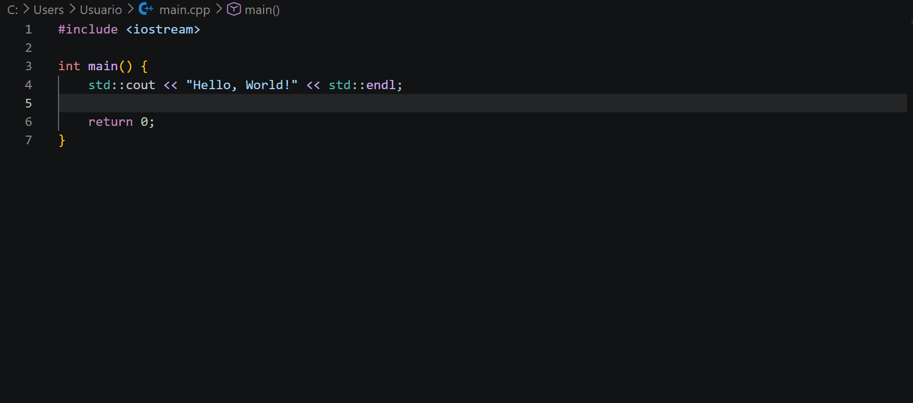
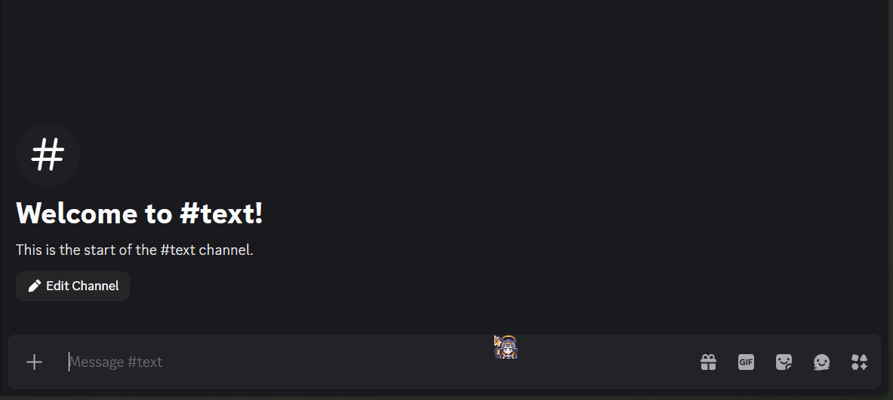
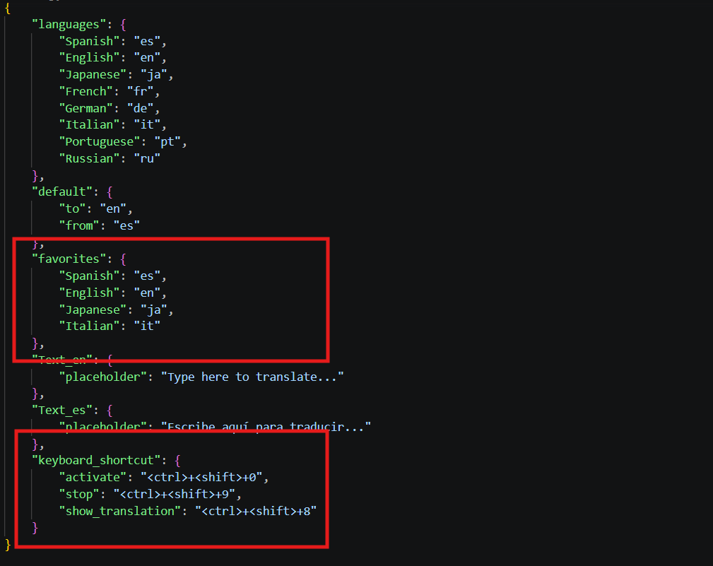

# TranslateApp 1.0

Desktop application to **translate text on the fly** using global hotkeys, a floating bar, and automatic paste into the previously focused window (Windows).

---

## 📸 Screenshots







---

## Requirements

* **Windows** (uses window APIs and clipboard pasting).
* **Python 3.10+** (if running from source).
* Internet connection (translation via online service).

---

## Installation (from source)

```bash
git clone https://github.com/OsHK00/desktop-translator.git
cd translateapp
pip install -r requirements.txt
```

Run **from the root of the repository**:

```bash
python src/translateapp/main.py
```

(The script adds `src` to the path when not packaged; if you use a different layout, make sure the `translateapp` package is importable.)

---

## 🚀 Quick Start

1. Start the application: it will run in the **system tray** (*Desktop Translator* icon).
2. Focus any window where you want to paste the translation.
3. Press the **activation shortcut** (default `Ctrl+Shift+0`): the **translation bar** appears centered and always on top.
4. Type your text and press **Enter**: it translates and attempts to **paste the result** into the previous window.
5. Press **Escape** to close the bar without translating.
6. From the tray icon menu: **Show panel** or **Exit**. The stop shortcut (default `Ctrl+Shift+9`) closes the application.

Default shortcuts can be changed in the configuration (see below).

---

## 📸 Usage Preview





---

## Features (v1.0)

| Area               | Description                                                                                                                    |
| ------------------ | ------------------------------------------------------------------------------------------------------------------------------ |
| **Global Hotkey**  | Opens the bar while capturing the active window to restore focus and paste later.                                              |
| **Floating Bar**   | Borderless, semi-transparent, centered; shows **source** and **target** languages.                                             |
| **Language Panel** | Favorite languages defined in config; switch source/target with one click.                                                     |
| **Swap Languages** | Button to invert source ↔ target (saved in `config.json`).                                                                     |
| **Translation**    | Sends text for translation and shows a visual loading state (bar becomes non-editable).                                        |
| **Paste**          | Copies translation to clipboard, focuses previous window, and simulates **Ctrl+V**; restores previous clipboard when possible. |
| **System Tray**    | Show panel manually or exit the app.                                                                                           |
| **Logging**        | Logs stored in `logs/app.log` (same root as config).                                                                           |

---

## ⚙️ Configuration (program root)

All configuration is generated in the **program root folder** (next to the `.exe` if packaged, or project root if running from source):

* **`config/config.json`** — languages, favorites, default languages, UI text, and **keyboard shortcuts**.

To change any option, **edit the JSON file** using a text editor (keep valid JSON syntax: quotes, commas, and braces).

---

### Reset to default values

If the file is corrupted or you want defaults:

1. Close the application.
2. **Delete** `config/config.json` (or the entire `config` folder).
3. Run the app again: a new `config.json` will be created with default values.

> **Note:** If the file exists but contains invalid JSON, the app may fail to start until you fix or delete it.

---

### Useful keys in `config.json`

* **`languages`**: map of name → language code
* **`favorites`**: languages shown in the quick panel
* **`default`**: default `from` and `to` language codes
* **`keyboard_shortcut`**: pynput-style strings, e.g. `"<ctrl>+<shift>+0"`
* **`Text_en` / `Text_es`**: UI helper texts (e.g. placeholders)

---

## 📸 Configuration Example

<!-- Add config JSON screenshot -->



---

## License

MIT

---

## Contributing

Fork the repository, create a new branch, make clear commits, and submit a pull request.

---

---

## Developer Guide

If you want to **run, modify, or build the project**, check the full developer documentation:

[Developer Guide](./docs/DEVELOPER_GUIDE.md)

---