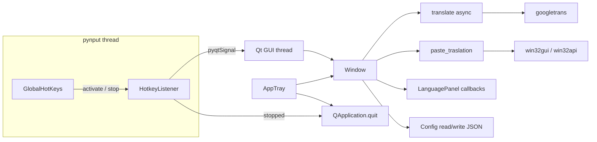

## Developer guide

This section is for people who want to **run, change, or package** the app from source.

### Tech stack

- **PyQt6** + **qasync** — UI (floating bar, language panel, tray) and asyncio integration.
- **pynput** — global hotkeys (activation, stop, optional “show translation” shortcut).
- **pywin32** — foreground window handle, window placement, focus/restore for paste.
- **pyperclip** / **clipboard helpers** — copy and paste flow.
- **googletrans** — translation calls (network required).

Dependencies are pinned in `requirements.txt`. Install with `pip install -r requirements.txt` (preferably in a virtual environment).

### Repository layout

| Path | Role |
| ---- | ---- |
| `src/translateapp/main.py` | Entry point: ensures `src` is on `sys.path` when not frozen, sets up logging, creates default config, starts the app. |
| `src/translateapp/core/` | Hotkey listener, translation, clipboard, logging. |
| `src/translateapp/ui/` | `Window` (bar), `LanguagePanel`, `AppTray`. |
| `src/translateapp/config/` | Default config creation and `Config` JSON loader. |
| `src/translateapp/paths.py` | **Program root** and bundled asset paths (PyInstaller `_MEIPASS`). |
| `assets/` | Icons used by the window and the PyInstaller build. |
| `TranslateApp.spec` | PyInstaller spec (datas include `assets/`). |

At runtime, **`config/config.json`** and **`logs/app.log`** live under the **program root** (`paths.app_root()`): next to the `.exe` when frozen, or the **repository root** when you run `python src/translateapp/main.py` from the repo root.

### Run from source (debugging)

From the **repository root**:

```bash
pip install -r requirements.txt
python src/translateapp/main.py
```

`main.py` adds `src` to `sys.path` when the app is not packaged, so imports like `translateapp.core` resolve without installing the package as editable.

### Architecture

1. **`global_hotkey.run()`** creates `QApplication`, installs **qasync**’s `QEventLoop`, builds `Window` and `HotkeyListener`, and starts **pynput** `GlobalHotKeys` for shortcuts from config.
2. On activate, the listener captures the **foreground window** (`GetForegroundWindow` + `GetWindowPlacement`) and emits a signal so the UI can **restore focus** and **paste** after translation.
3. **`Window`** runs async translation via **`asyncSlot`** and uses **`clipboard.paste_traslation`** (and related helpers) after copying the result.
4. **`AppTray`** keeps the process alive when the bar is closed (`quitOnLastWindowClosed` is false); the stop hotkey quits the app and stops the hotkey thread cleanly.

### Build a Windows executable

Requires **PyInstaller** (see `requirements.txt` for a minimum version). From the repository root:

```bash
pyinstaller TranslateApp.spec
```

Output is produced under `dist/` (see the spec’s `name` and `icon` settings). Keep **`assets/`** in sync with `datas` in the spec if you add resources.

### Configuration in code

- Defaults for a missing `config/config.json` are defined in `src/translateapp/config/initial_config_file.py`.
- Runtime reads/writes go through **`Config`** in `loadconfig.py` (paths resolved with `app_root()`).
- **`keyboard_shortcut`** is read in `core/global_hotkey.py` via `Config.get_keyboard_shortcut_*()`. The keys must exist in JSON (`activate`, `stop`, `show_translation`) or startup will fail when building the hotkey map. The repo’s sample `config/config.json` includes them; if you regenerate defaults in `initial_config_file.py`, keep that structure in sync.

### Feature map — what to open when you change behavior

| What you want to change | Start here | Notes |
| ----------------------- | ---------- | ----- |
| Global shortcuts (strings, new combo) | `config/config.json` → `keyboard_shortcut`; wiring in `core/global_hotkey.py` (`GlobalHotKeys` dict, `HotkeyListener.start`) | Uses **pynput** hotkey strings (e.g. `"<ctrl>+<shift>+0"`). |
| What happens when the user presses **activate** | `core/global_hotkey.py` → `_on_activate`, `run()` slot `_on_hotkey` | Captures **HWND** + **window show mode** (`GetWindowPlacement`), then shows the bar. |
| Floating bar layout, styles, Enter / Escape | `ui/window.py` | `configLayout`, `traslate_text`, `keyPressEvent`, `focusOutEvent`, `show_window` / `hide_window`. |
| “Translating…” state (disabled input, border) | `ui/window.py` → `_set_translating_ui` | Called around `traslate_text`. |
| First-hotkey / focus quirks on Windows | `ui/window.py` → `prime_translation_bar_once`, `_win32_bring_to_foreground`, `_ignore_focus_out_until` | Startup `QTimer.singleShot(0, …)` in `global_hotkey.run()` triggers a one-time prime. |
| Translation API / errors / languages passed in | `core/translate.py` | `translate()` is **async**; called from `Window.traslate_text` with `from`/`to` from config. |
| Paste into previous app, clipboard restore | `core/clipboard.py` → `paste_traslation` | Saves clipboard, copies result, restores window state (normal/maximized), **Ctrl+V** via `win32api.keybd_event`, restores old clipboard. |
| Favorites grid, picking from / to | `ui/languages_panel.py` | `show_panel(callback, mode)` stores `clicked_by` and calls it from `on_language_selected`; `Window` passes `set_from_language` / `set_to_language`. |
| Swap source ↔ target (button + persisted JSON) | `ui/window.py` → `swap_helper`; persistence in `config/loadconfig.py` → `swap_default` | Also updates `language_panel.selected_from` / `selected_to`. |
| Tray menu | `ui/tray.py` | “Mostrar panel” → `window.show_window`; “Salir” → `app.quit`. |
| Log file path / format | `core/logg_manager.py`; paths from `loadconfig.DEFAULT_CONFIG_LOG_PATH` | `setup_logger()` runs from `main.py` before UI. |
| Icons (window, tray, installer) | `paths.py` → `resource_path`, `default_window_icon_path`; `assets/`; `TranslateApp.spec` | Frozen build looks under `_MEIPASS` then falls back to `app_root()`. |

### How pieces communicate

- **pynput** runs its listener on a **background thread**. `HotkeyListener` inherits `QObject` and uses **`pyqtSignal`** (`activated`, `stopped`) so hotkey callbacks only **emit**; Qt delivers slots on the **GUI thread** (safe for `Window` / Qt APIs).
- **`Window`** holds **Win32 state** for the last target app: `last_window` (HWND) and `win_mode` (from `GetWindowPlacement`), set from `global_hotkey.run()` when `activated` fires.
- **`LanguagePanel`** does not talk to `Config` directly: `Window` registers **callbacks** (`set_from_language`, `set_to_language`) when opening the panel.
- **`Config`** is instantiated where needed (`HotkeyListener` uses a module-level instance in `global_hotkey.py`; `Window` creates its own). All instances point at the same `config.json` path (`app_root()`); after writes, other parts of the app do not auto-reload the file until you restart or add reload logic.



### End-to-end flows (step by step)

**1) Startup**

1. `main.py` → `logg_manager.setup_logger()` → log file under `logs/`.
2. `create_config_file()` if `config/config.json` is missing (`initial_config_file.py`).
3. `global_hotkey.run()` → `QApplication`, `qasync` loop, `Window`, `HotkeyListener`, `AppTray`.
4. `listener.start()` registers three hotkeys from config.
5. `QTimer.singleShot(0, window.prime_translation_bar_once)` mitigates first-use focus issues on Windows.

**2) User presses the activation shortcut**

1. `HotkeyListener._on_activate` runs on the pynput thread → reads **foreground HWND** and **placement mode** → `activated.emit(hwnd, mode)`.
2. In `run()`, `_on_hotkey` runs on the Qt thread → `window.set_window_mode`, `set_last_window`, `show_window` (center, show, raise, optional `SetForegroundWindow` for the bar, delayed focus on `QLineEdit`).

**3) User types text and presses Enter**

1. `QLineEdit.returnPressed` → `Window.traslate_text` (`@asyncSlot`).
2. `_set_translating_ui(True)` blocks interaction while translating.
3. `translate(...)` in `core/translate.py` runs (async).
4. On success, `paste_traslation(text, hwnd_window=last_window, win_mode=...)` in `clipboard.py` → then `hide_window()`.
5. `_set_translating_ui(False)` in `finally`.

**4) User opens the language panel**

1. Clicks **from** or **to** on the bar → `language_panel.show_panel(self.set_from_language, mode="from")` (or `"to"`).
2. User picks a button → `on_language_selected` → invokes the stored callback with the **language code** → `Config.set_default_from` / `set_default_to` writes JSON → button labels update on the bar.

**5) Exit**

- Tray **Salir** → `app.quit`, or stop hotkey → `HotkeyListener._on_stop` → `stopped` → `app.quit`.
- `aboutToQuit` stops and joins the pynput hotkey thread (`_stop_hotkey_listener` in `global_hotkey.py`).

### Conventions and naming to grep for

| Concept | Symbol / pattern | Location |
| ------- | ---------------- | -------- |
| Async UI handler for translate | `traslate_text`, `@asyncSlot` | `ui/window.py` |
| Paste pipeline | `paste_traslation` | `core/clipboard.py` |
| Hotkey → UI bridge | `activated`, `stopped`, `_on_hotkey` | `core/global_hotkey.py` |
| HWND + show mode | `last_window`, `win_mode`, `set_last_window` | `ui/window.py` |
| Panel callback pattern | `show_panel`, `clicked_by`, `on_language_selected` | `ui/languages_panel.py` |
| Config keys | `get_keyboard_shortcut_*`, `swap_default`, `set_default_*` | `config/loadconfig.py` |

### Contributing code

Follow the same flow as [Contributing](#contributing): short, focused changes; test hotkeys, tray exit, and paste behavior on a real Windows session when you touch `core/` or `ui/`.
